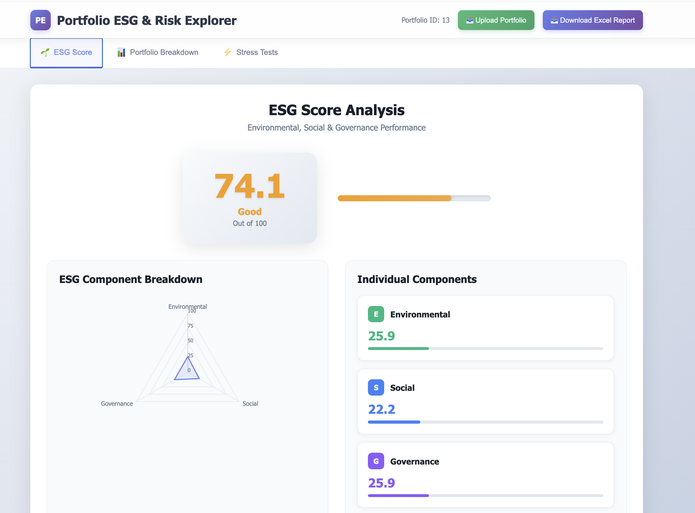
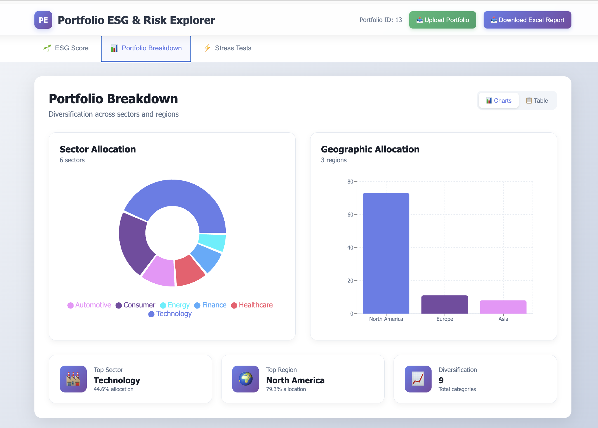
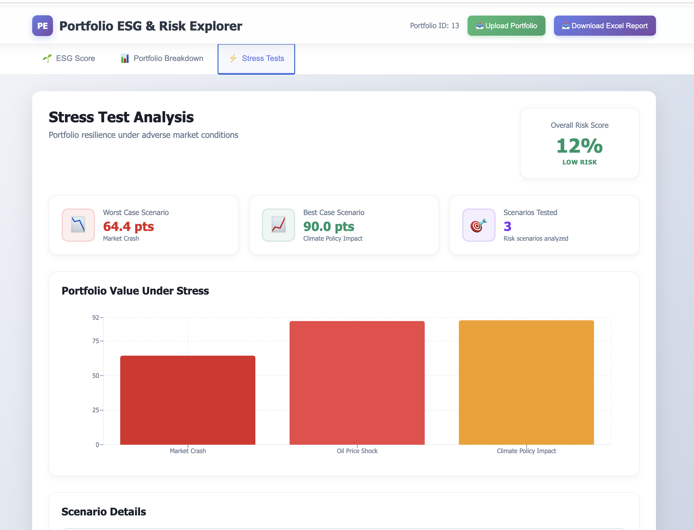
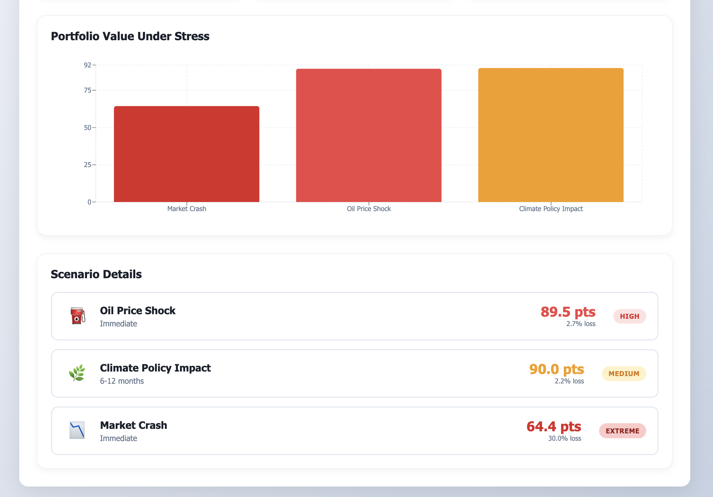

# Portfolio ESG & Risk Explorer

A full-stack application for analyzing investment portfolios with ESG scoring, sector/regional breakdown visualization, and stress testing capabilities.

## 📋 Table of Contents

- [Features](#features)
- [Screenshots](#screenshots)
- [Tech Stack](#tech-stack)
- [Prerequisites](#prerequisites)
- [Quick Start](#quick-start)
- [Usage](#usage)
- [Local Development](#local-development)
- [Docker Services](#docker-services)
- [CI/CD](#cicd)
- [License](#license)

---

## Features

- **ESG Analysis**: Calculate weighted ESG scores with Environmental, Social, and Governance component breakdowns
- **Portfolio Breakdown**: Visualize sector and regional allocation with interactive charts
- **Stress Testing**: Simulate portfolio performance under adverse market scenarios
- **Excel Reports**: Generate comprehensive XLSX reports with complete portfolio analysis
- **File Upload**: Import portfolio data via Excel files

---

## Screenshots

### ESG Score

### Portfolio Breakdown

### Stress Test

---

## Tech Stack

**Frontend:**
- React 18 with TypeScript
- styled-components
- Recharts
- Vite

**Backend:**
- Spring Boot 3.5.6
- Java 17
- Spring Data JPA

**Infrastructure:**
- MySQL 8.0
- MinIO (S3-compatible storage free alternate for AWS)
- Docker & Docker Compose

---

## Prerequisites

- Docker 20+
- Docker Compose 3.8+

For local development:
- Node.js 20+
- Java 17+
- Maven 3.9+

---

## Quick Start

### Clone repository
git clone <repository-url>
cd portfolio-esg-risk-explorer

### Start with Docker Compose
docker-compose up -d

#### Access application
#### Frontend: http://localhost
#### Backend API: http://localhost:8080
#### MinIO Console: http://localhost:9001

---

## Usage

### Upload Portfolio

Create an Excel file (.xlsx) with the following structure:

| Ticker | Weight | Sector | Region | ESG Score |
|--------|--------|--------|--------|-----------|
| AAPL | 0.15 | Technology | US | 85 |
| TSLA | 0.10 | Automotive | US | 78 |
| XOM | 0.08 | Energy | US | 45 |

- **Weight**: Decimal format (0.15 = 15%)
- **ESG Score**: 0-100 scale

**Stress Test Scenarios:**
- `oil-shock`: 50% reduction in energy sector
- `climate-policy`: Penalties on carbon-intensive sectors
- `market-crash`: 30% reduction across all holdings

---

## Local Development

### Run backend
cd server
mvn spring-boot:run

### Frontend
cd client
npm install
npm run dev

---

## Docker Services

| Service | Port | Description |
|---------|------|-------------|
| frontend | 80 | React application |
| backend | 8080 | Spring Boot API |
| mysql | 3306 | Database |
| minio | 9000, 9001 | Object storage |

---

## CI/CD

GitHub Actions workflow included for automated testing:
- Runs on push to `main` and pull requests
- Sets up Java 17, MySQL, and MinIO
- Executes Maven tests

---

## License

MIT License © 2025  

---

Built with ❤️ using **React, Spring Boot, MySQL and Docker**

